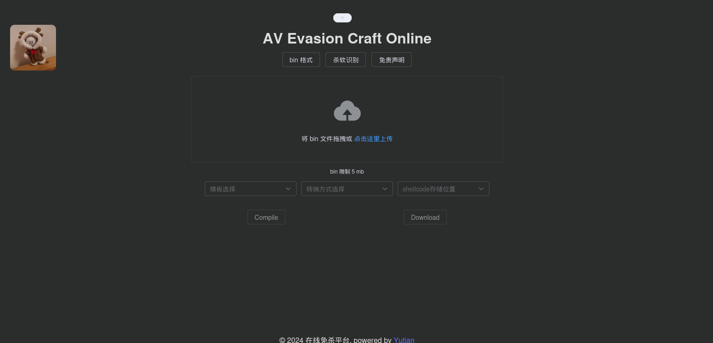
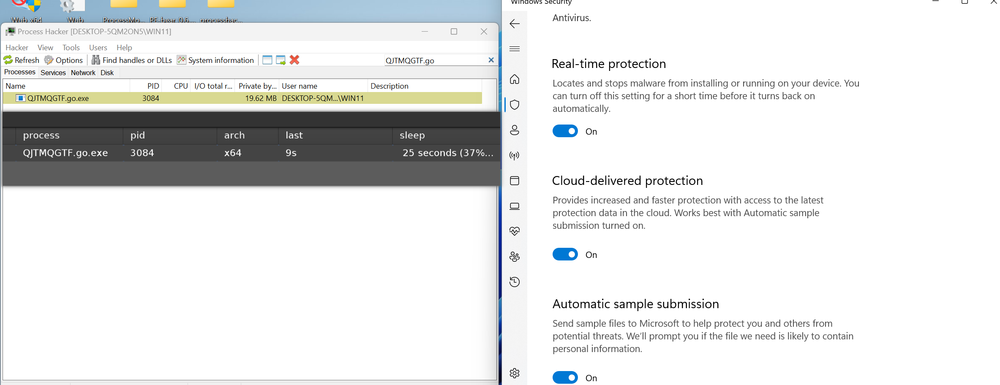
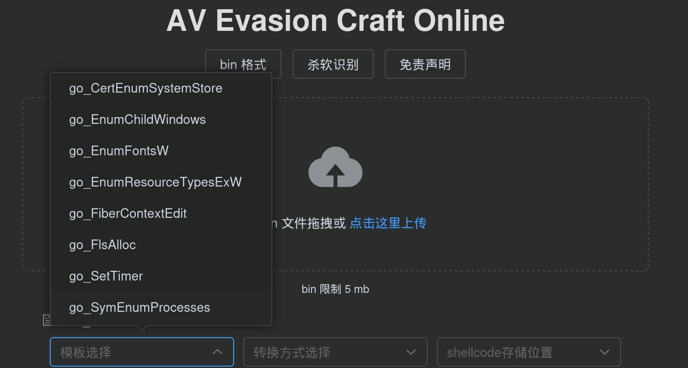
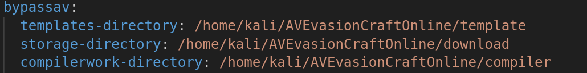

> 免责声明：本工具仅供安全研究和教学目的使用，用户须自行承担因使用该工具而引起的一切法律及相关责任。作者概不对任何法律责任承担责任，且保留随时中止、修改或终止本工具的权利。使用者应当遵循当地法律法规，并理解并同意本声明的所有内容。

# AV Evasion Craft Online

**不要搭建在公网中** 有问题请先看 [issues](https://github.com/yutianqaq/AVEvasionCraftOnline/issues)

代码维护/新增请参考 [先知社区-Golang 免杀与AV Evasion Craft Online 在线免杀生成平台](https://xz.aliyun.com/t/13411?time__1311=mqmxnDBQqDq7wq05d4%2BxCuwCxu7faQQY4D#toc-6:~:text=%E5%A2%9E%E5%8A%A0%E4%B8%80%E5%AE%9A%E9%9A%BE%E5%BA%A6-,Go%20%E5%85%8D%E6%9D%80,-%E5%B9%B3%E5%8F%B0%E8%87%AA%E5%B8%A6)

可绕过常见杀软

## 特点
​	1、轻松使用
- 通过简单的上传操作，用户可以生成免杀 Payload，无需手动配置和编码。

2、时间节省
- 减少协作时的环境配置和手动操作，提高效率。

3、模板化
- 用户可以通过配置文件快速应用不同的载入方式，增加生成的 Payload 的多样性。

生成的压缩包密码为 yutian

支持编译 nim、go、c 语言

支持 3 种 shellcode 存储方式（内嵌、本地、远程）

2024年3月10日 更新 8 种加载方式 （Golang）

# 安装

[详细版本](https://github.com/yutianqaq/AVEvasionCraftOnline/wiki)

模板不定期更新，启动后端时请指定参数

下载后，修改 application.yaml 中的路径(**非常重要**)

接着指定参数，jar 包名称需要更改。之后访问对应的端口即可

`java -jar -Dspring.config.location=application.yaml AVEvasionCraftOnline.jar --server.port=80`

# 参考

https://github.com/wsheeny/vite-vue-template

https://github.com/r00tSe7en/get_AV

https://github.com/qi4L/CallbackLoader
