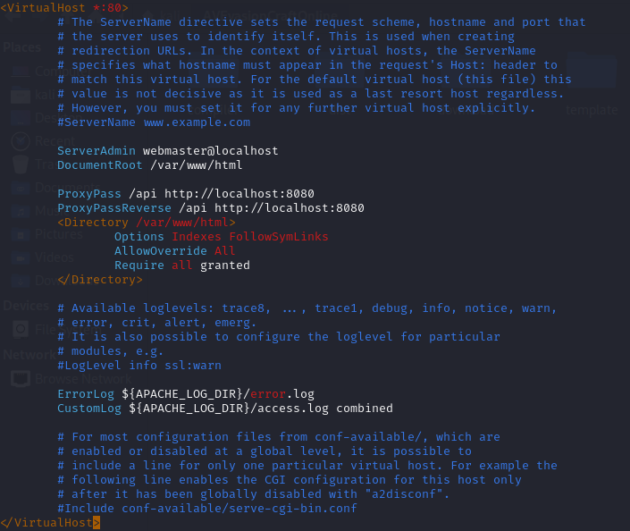
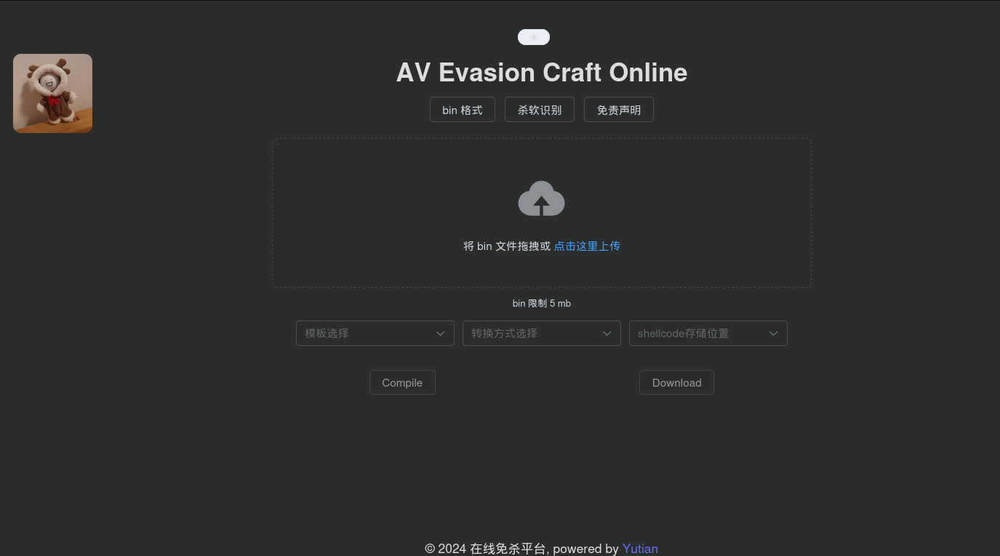
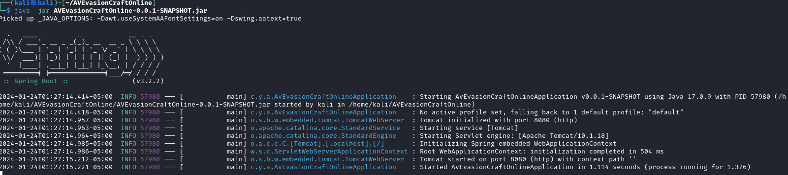

下载发行版，以下搭建过程基于 Kali Linux 2023.4
### 依赖安装

**nim & c 依赖**

```
sudo apt update
sudo apt install mingw-w64

curl https://nim-lang.org/choosenim/init.sh -sSf | sh
# 输入 y 

echo "export PATH=$PATH:/home/kali/.nimble/bin" >> ~/.zshrc
source ~/.zshrc
nimble install winim
# 输入 y 
```

**go 依赖**
```
wget https://go.dev/dl/go1.21.6.linux-amd64.tar.gz

sudo rm -rf /usr/local/go && sudo tar -C /usr/local -xzf go1.21.6.linux-amd64.tar.gz

echo "export CGO_ENABLED=0" >> ~/.zshrc
echo "export GOOS=windows" >> ~/.zshrc
echo "export GOARCH=amd64" >> ~/.zshrc
echo "export PATH=$PATH:/usr/local/go/bin" >> ~/.zshrc
source ~/.zshrc
```

### 前后端配置
```bash
cd /home/kali
unzip AVEvasionCraftOnline.zip

cd AVEvasionCraftOnline

sudo cp -r dist/* /var/www/html && sudo chown -R www-data:www-data /var/www/html
```

开启模块
```bash
sudo a2enmod proxy
sudo a2enmod proxy_http
sudo a2enmod rewrite
```

编辑 `/etc/apache2/sites-available/000-default.conf` 增加以下配置

```bash
        ProxyPass /api http://localhost:8080
        ProxyPassReverse /api http://localhost:8080
        <Directory /var/www/html>
                Options Indexes FollowSymLinks
                AllowOverride All
                Require all granted
        </Directory>
```



重启 Apache 服务器
```bash
sudo systemctl restart apache2
```



修改配置文件
templates-directory、storage-directory、compilerwork-directory 修改为相应的路径
```
bypassav:
  templates-directory: /home/kali/AVEvasionCraftOnline/template
  storage-directory: /home/kali/AVEvasionCraftOnline/download
  compilerwork-directory: /home/kali/AVEvasionCraftOnline/compiler
```

启动后端
```bash
java -jar AVEvasionCraftOnline-0.0.1-SNAPSHOT.jar
```

至此完成前端，后端配置



